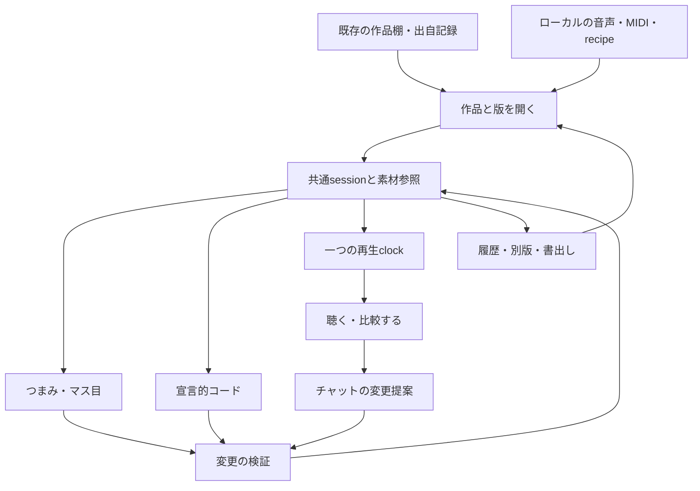

# ブラウザ制作台 — 既存のネタを開いて、触って、育てる推奨設計

2026-09-19 / **推奨設計・未実装**。対象はMusic内の制作面。
依頼: チャットで生成したネタを思い出し、コードと画面の両方から続きを触れるようにする。
実装順の正本は[BACKLOG](autonomy/BACKLOG.md)のBL-049 → BL-045。

## 1. 採る構成

**既存作品の入口＋ブラウザの編集台＋共通の編集データ**をMusicの中につくる。
初回はTidalの導入、GPU生成、新しい管理repoを必要条件にしない。

| 判断 | 推奨 | 理由 |
|---|---|---|
| 最初に育てる対象 | 既存の短いstem一組。元の比較版も一緒に扱う | 実在するネタを自分の操作で変える体験へ最短で到達できる |
| 最初の再生 | 既存の固定版Tone.js＋Web Audioで独立preview | 音声素材と有限の音符列を一つの時計で扱い、既存の音源資産も活かせる |
| 編集の正本 | 作品に属するversion付きsession | チャット・つまみ・マス目・宣言的コードが同じ状態を編集する |
| ライブコード | Strudelを独立した試奏候補として評価。その後に限定adapter | コードの楽しさを試せる一方、既存のWAVやTone音源を無理に移植しない |
| 最初の保存 | 端末内の自動下書き＋明示的なsession書出し | タブを閉じても続きへ戻り、ブラウザ保存が失われても復旧できる |
| 最初の端末 | PCブラウザでstem編集。iPhoneは短い試聴・比較・再開カードから | 同じ画面構成を使い、長尺多層のメモリ負荷は実機で段階確認する |

今回の成果は設計。下記の画面、session、bridge、adapterを実装済みとは扱わない。
既存の試聴・制作経路は[全体manual](MUSIC-STACK-SYSTEM-MANUAL.md)が正本。

## 2. 利用者の一周

1. 「続きを触る」にある作品を開く。狙い・最後に触った版・次の一手が一行で分かる。
2. 前回と同じ区間を聴く。気になった位置に「ここを残す」「残響を減らす」を置く。
3. 一つのパートをつまみで変えるか、チャット／コードで変更する。
4. 変わった箇所が光り、「pad -6 dB」のように結果が見える。
5. 同じ位置で元と別版を切り替える。「いい」を付けても元の版は残る。
6. 閉じて、後日、同じ素材・区間・設定から再開する。

チャット返答を待つ間も、再生と手操作は続けられる。
生成した案は現在の作品の子として残り、無関係なファイル一覧へ散らばらない。

### 画面の配置案

これは情報配置のワイヤーフレームで、完成UIのスクリーンショットではない。

```text
作品名                  「低音を残して、上を少し薄く」
前回: padを減らした版     次: 残響だけ比べる
[再生 / 停止] [区間] [元と比較] [戻す] [保存]

素材・パート             時間軸 / 波形 / 音符
  Drums   [音量][M/S]      ■ · ■ · ■ · …
  Bass    [音量][M/S]      ━━━   ━━━ …
  Air     [音量][M/S]      ░░░░░░░░░ …
  Returns [音量][M/S]      共有残響など、必要時に開く

[画面で編集] [コード]     選択部分: Air、3〜4小節
「ここだけ少し薄く」      変更: Airの音量 -3 dB

版の履歴: 原本 → 余白を増やす → 残響を減らす
```

スマートフォンは「聴く／触る／履歴」の切替と固定した再生・停止を使う。
常時横並びのコード画面を必須にせず、パート名や数値でも状態を把握できるようにする。
選択と再生位置は色だけに頼らずラベルでも表示。つまみは数値入力とキーボード操作も持つ。

## 3. 過去素材の入口

編集能力は素材ごとに示す。一つの作品に複数種類を混在させてよい。

| 残っているもの | 初回から提供する編集 | 次に必要なもの |
|---|---|---|
| 完成WAV / M4A | 区間選択、切出し位置、音量、fade、追加エフェクト、別版比較 | 個々の楽器を触るならstem、音符を触るなら別の再構成工程 |
| 時刻の揃ったstems | パートのmute / solo / gain、区間loop、組合せ、別版保存 | 焼き込まれた音色や音符の変更は元の生成器またはpattern |
| MIDI / event列 | 音符位置・長さ・強弱・休符、対応する音源設定 | MIDIには含まれない音色・slide・調律の対応表 |
| 元コード＋recipe | 出力できるevent / stemをadapterへ渡す。元revisionも保持 | 実行環境、入力、依存版。Python等の長い生成処理は別工程 |
| 自由なStrudelコード | コードのまま演奏し、対応するparameterを操作 | マス目で編集するなら、対象区間を有限event列へ固定するadapter |
| sourceが回収待ち | 手元の録音を聴く・切る・比較する | sourceが見つかった時点で編集能力を追加する |

録音から元のMIDI／シンセ設定が自動復元される前提は置かない。
再構成版は原本を親・参照として持ち、「同一再現」と別に記録する。
原本のhash、由来、本人の採用判断は[出自ガイド](WORK-PROVENANCE-GUIDE.md)に従う。

### 最初のstem編集

- 主画面はDrums / Bass / Airの役割でまとめるが、元のstem名と7パート等の個別操作を保持する。
- 共有echo / reverbは独立したreturnとして表示。元パートをmuteしても録音済みreturnには成分が残ることを示す。
- premaster参照、完成master、作業mixは排他的に試聴する。参照音声をstemに重ねない。
- master処理済み音源とstem合計の音量・音質差を、再現失敗や改善成功と即断しない。
- v1の録音clipは原速。BPM不明を推測値で確定せず、録音との同期中はtempo変更を制限する。
  独立した音符sceneではBPM変更可能。高品質なtime stretchは後の独立課題にする。

## 4. 同じ状態を触るための構造



**正本はsession。コード表示と画面表示を別々に保存して食い違わせない。**
元の録音・生成コードはsourceとして保持し、編集は新しいrevisionに積む。

| 要素 | 保存する情報 |
|---|---|
| work | 安定したworkId、既存catalog / Lyric Labへの参照、狙い、再開位置 |
| revision | id、parentRevision、変更の説明、日時、変更した手段、checkpoint |
| timeline | 拍子、tempo、選択区間、loop範囲、tempoLocked理由 |
| assetRef | id、hash、形式・尺・sample rate・channels、出自、必要なローカルfileの名前 |
| track | id、役割、音声／event／free-codeの種別、mute / solo / gain、effect設定 |
| clip | assetへの参照、元音声のframe範囲、配置、fade。元音声へ書き戻さない |
| event | id、拍位置、長さ、音高、強弱、accent / slide、使用音源 |
| recipe | generator id・revision、依存版、seed、入力hash、出力条件 |
| feedback | 対象revisionと区間、残す点・直す点。既存verdictと二重管理しない |

8小節は最初の編集窓の大きさ。既存ネタの異なる周期を8小節・16stepへ強制変換しない。
trackごとの周期と元の拍位置を保持し、対応外の表現は明示する。
音声はframe、音符はbeatを正本にし、時間表示へ変換する。録音をgridへ勝手に丸めない。
非12平均律は音高にfrequency / tuning参照を持てるようにし、通常MIDI持出し時の欠落を表示する。

### コードの二つの範囲

**通常編集:** 検証できるsession / pattern記述をコード表示する。
gain、mute、note、gate、accent等は画面と双方向に同期し、汎用JavaScriptのevalを使わない。

**自由なライブコード:** Strudel原文を正本にするsceneとして別扱い。
任意の関数・無限patternを編集可能なgridへ逆変換できるとは約束しない。
将来の「この8小節を固定」は、その時点の有限event列を子revisionへ保存する操作。
固定後にそのgridを変えても、元の自由コードを自動で書き換えない。

## 5. チャットとの往復

チャットへ渡すのは選択したwork / revision / track / 区間と、変更可能な項目。
音声ファイルや非公開パスの自動送信はしない。聴感の判断は本人の言葉へ結びつける。

変更提案は例えば以下の形をとる。これは設計例で、既存APIではない。

```json
{
  "workId": "local-work-01",
  "baseRevision": "r3",
  "summary": "Airの音量を-3 dBにする",
  "operations": [{ "op": "setGainDb", "trackId": "air", "value": -3 }],
  "applyAt": "nextBar"
}
```

- track / eventの安定ID、revision、許可した操作、値の範囲を検証する。
- 人が返答待ち中に編集し、baseRevisionが古くなった場合は勝手に上書きしない。
  操作対象が変わらない場合のみ再検証し、それ以外は差分を提示して再提案する。
- つまみは短いrampで反映。patternの変更は次小節／次loopへ予約し、予約を取り消せる。
  不正な変更は現在の演奏を残し、STOPはチャット・解析・生成処理を待たない。
- 「音量を下げる」「音符を間引く」「元の音色を再生成する」は別の操作として説明する。
- 変更後に履歴を一件作り、drag中の各pixelや途中の入力を大量の版として残さない。

段階1は選択内容のcopyと変更JSONのimportで成立させる。
段階2で同じ検証経路にローカルbridgeを接続し、現在の会話から届いた変更を自動受信する。
bridgeは対象sessionに限定した受渡しとし、汎用shell実行や任意file読込をブラウザへ公開しない。
ブラウザ内のAIチャット、認証、別端末への配信は現行Musicにない追加実装として扱う。

## 6. 既存システムから活かす部分

| 既存資産 | 制作台への受渡し・再利用 | 境界 |
|---|---|---|
| Lyric Lab / private制作ノート | workId、意図、親素材、再開先、足りない素材 | 新しい採用台帳を作らず既存の判定を参照する。歌詞やprivate記録をpublicへ載せない |
| Listening Loop | 有限score.events、candidate params、seed、評価履歴 | 現行は20秒・96 BPM・8小節、保存メモはscore全文を含まない。event固定とimportは追加実装 |
| Core Rig / Hazama FM | 音色のrecipe、faderの考え方、既存の録音 | `engine.js`を埋め込まず、公開された設定をadapterで翻訳。音の完全一致は別確認 |
| Drum Floor | groove / MIDI / 強弱・休符を有限eventへ翻訳 | リズムの正本はsister repo。browserを重ねて同時再生する接続にしない |
| Band Room | 和声設計、パート操作、比較・録音の知見 | 現行MIDI読込は先頭1小節のドラム用。汎用importとして流用しない |
| chill / namima | 余白・和声のrecipe。offline側から明示出力したstem / event | 独立した各runtimeをコピーしない。offlineとPWAの音源を混同しない |
| ACE-Step等 | 気に入った録音断片、対応するprompt / recipe | 重い再生成は別job。即時のつまみ操作に見せない |
| OpenClaw Desk / SYNC | 行き先・設定・制作段取り | 音声、sample精度clock、全sessionの保存を今のSYNCに期待しない |
| Sonar | WAV / stems / MIDI＋音色メモの持出し先 | project自動操作、VST host、完全なDAW往復は初回範囲外 |

Listening Loopの現物: [model.mjs](../experiments/listening-loop/v1/model.mjs)、
[audio.mjs](../experiments/listening-loop/v1/audio.mjs)、[app.mjs](../experiments/listening-loop/v1/app.mjs)。
既存previewのコードは有限eventと独立contextの実装参考。固定20秒のplayerを汎用loop対応済みとは扱わない。

## 7. StrudelとTidalの採り方

1. Strudelの既成REPLで、匿名の短いpatternをコードで変える体験を比較する。
2. 気に入った操作を通常sessionで表現できる範囲へ絞る。埋込みやevent固定はadapter試作で確認する。
3. 高度な自由コードが必要なら、独立sceneとして保存できるようにする。
4. PC専用音源を深く使いたくなった段階でSuperDirt / SuperCollider接続を評価する。Tidalは必須にしない。

StrudelはREPL埋込みとUIなしライブラリを公式に提供するが、
**旧`@strudel/tone`は公式一覧で保守終了扱い**。既存Tone.jsへの直結を完成済みの橋と見なさない。
v1の通常編集はTone.js側の単一rendererに集め、Strudelの別schedulerと同時走行させない。

組込みはAGPL-3.0の条件がある。Music READMEの現行license表記との整合は未確定なので、
本設計で依存追加や配布licenseの変更は行わない。実装前の採用判断に記録する。
外部REPLへprivate素材・作品ID・保存先を送る導線は作らない。

## 8. 保存と端末間の再開

- sessionの自動下書きとrevisionはIndexedDBへ。音声はユーザーが選んだfileを素材参照へ結びつける。
- 初回はfile pickerを共通入口にする。ページが任意のPC絶対パスを開けるとはしない。
- 音声を端末内へ複製保存する場合は容量と保存結果を表示。metadataだけの保存と区別する。
- session JSONと必要素材一覧を明示書出しできるようにし、browser内だけを唯一の保管先にしない。
- 再読込時に素材が欠けていれば、必要fileとhashを示して選び直す。違う音声へ黙って差し替えない。
- 別PC / iPhoneはsessionと素材の両方が必要。最初はFiles等から明示取込し、cloud自動同期を約束しない。
- 既存Lyric Labの認証付き保存と、GitHub Pagesの端末内保存を混同しない。
  cloud統合は既存認証・storageの範囲を確認してから設計を拡張する。

初回previewはMusic内の明示URLから開き、ユーザーの再生操作で音声を起動する。
予定配置は`experiments/workbench/v1/`。新しいrepoや既定の再生経路は増やさない。
同時に動く再生時計は一つ。STOP / panic、旧graphの解放、重い処理の分離を最初から持つ。
初回はforegroundを対象とし、非表示・中断時は停止と状態保存、復帰後は手動再開にする。

## 9. 実装順と完成条件

| 順序 | 作るもの | 完成を判断する操作 |
|---|---|---|
| 1 / BL-049 | 既存の1作品・1区間からstemを開く。素材参照・revision・宣言的mix記述 | 一つの音量を変え、元と交互比較し、保存→閉じる→再読込で戻る |
| 2 / BL-049 | 波形・loop・つまみ、コードとGUIの同期、変更import | 同じパートを3つの入口で変更して状態が一致。undoで完全に元へ戻る |
| 3 / BL-045 | Drums / Acid / Airのevent編集とMIDI持出し | 残すパートを固定して一音だけ変え、seed以外に実eventも残して再開する |
| 4 / BL-045 | Strudel比較、必要なadapter、任意のローカルchat bridge | コード演奏の利点を本人が確認。型・revision・clock・licenseを確認して限定接続 |
| 5 / BL-046連携 | ほかの過去ネタへ展開、iPhone用の軽い受渡し | 音声のみの曲も入り、素材回収待ちで全体が止まらず、同じ作品へ戻れる |

初回の対象を増やしすぎない。**一つの過去ネタがもう一度触れる状態になること**を優先する。
本人が残すと決めた版を次の編集の起点にする。自動生成の数を成功指標にしない。

### 検証すること

- 保存・復元: asset hash / revision / gain / 区間 / eventが一致。元fileを上書きしない。
- 双方向編集: GUI変更→コード表示、コード変更→GUI、変更import→両方が同じ状態。
- 競合: 古いbaseRevision、不明track、壊れたJSON、範囲外の値を拒否。現在の演奏を壊さない。
- 音: 同時startとloop位置、クリック抑制、急連打、停止後のtailとgraph解放、referenceとの二重再生なし。
- 資源: decode前にframes × channels × 4 bytesの目安を確認し、全曲一括読込を避ける。
  PC・実iPhoneで対象stem数と区間長を測り、上限超過なら短い素材の再選択へ案内する。
- 比較: 同じ区間と再生位置で切替。音量差を表示し、比較用trimと実mixのfaderを別に保存。
- 欠損: browser保存消去、欠けたfile、同名別file、network失敗から再開できる。
- 人の判定: 前のネタだと思い出せるか、操作と変化が結びつくか、続きを触りたくなるか。

### 今回の設計で保留するもの

全曲の音符化、任意コードとgridの完全相互変換、全repoの同時演奏、常時background再生、
高品質なtime stretch、VST host、GPU生成の即時応答、機材自動操作、公開・配信は初回の完成条件に含めない。

## 10. 根拠と文書の関係

- この文書: 作品の再開から双方向編集までの全体設計。
- [Visual Composer](VISUAL-COMPOSER-PLAN.md): event編集・和声・acidの詳細。通常編集sessionへ接続する。
- [出自ガイド](WORK-PROVENANCE-GUIDE.md): 元素材・再生成・新規再構成の区別。
- [Listening Loop](LISTENING-LOOP-EXPERIMENT.md): 既存の有限scoreと試聴フィードバックの実装範囲。
- 具体的な未公開作品名、素材対応、保存先、着手順の候補はprivate制作ノート側にだけ置く。

外部一次資料（2026-09-19確認）:

- [Strudelを自分のprojectへ組み込む](https://strudel.cc/technical-manual/project-start/): REPL / UIなし利用、AGPL-3.0の案内。
- [Strudel Packages](https://strudel.cc/technical-manual/packages/): 出力先の分離と保守終了packageの区分。
- [Strudelの可視化](https://strudel.cc/learn/visual-feedback/): 演奏位置の強調、pianoroll等。GUIからの完全な逆変換を証明しない。
- [Tidalとの比較](https://strudel.cc/learn/strudel-vs-tidal/): 言語・音源・対応機能の差。
- [MDN IndexedDB](https://developer.mozilla.org/en-US/docs/Web/API/IndexedDB_API): 構造化データ・Blobの端末内保存と容量／削除条件。
- [MDN Web Audio best practices](https://developer.mozilla.org/en-US/docs/Web/API/Web_Audio_API/Best_practices): 再生操作と音声起動等の設計根拠。
